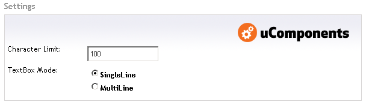

This simple data-type limits the number of characters that your content editor can enter into a text field.

Real-time feedback is displayed on the amount of characters left. If the number of characters is exceeded, the content will be trimmed.

## Prevalue Editor Settings

The data-type has the following configuration options:
* Character Limit (default 100)
* TextBox Mode - SingleLine or MultiLine

