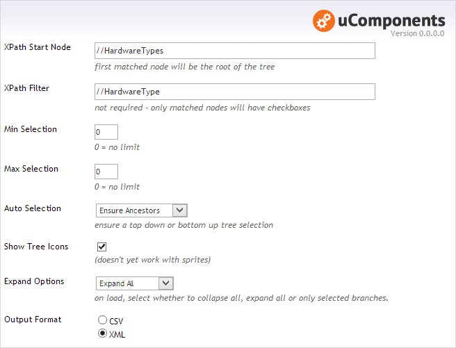
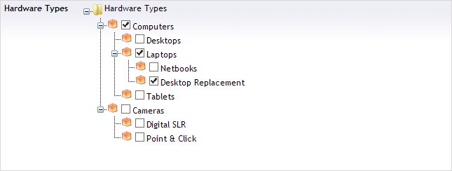

## Prevalue Editor Settings

**XPath Start Node** : (Required) The first matched node from this XPath expression will be used as the start node of the tree.

**XPath Filter** : (Optional) All nodes that match this XPath expression, and in the tree, will have an associated checkbox to allow selection.

**Min Selection** : (Required) Specifies the minimum number of nodes that must be selected.

**Max Selection** : (Required) Specifies the maximum number of nodes that can be selected (if set to 0, then this value is ignored).

**Auto Selection** : (Optional) When specified, this can be set to 'Ensure Ancestors' or 'Ensure Descendants'. Ensure Ancestors, will auto select all check boxes that are ancestors of a selected node, whilst Ensure Descendants will auto select all nodes beneath a selected node.

**Show Tree Icons** : When checked, will show the node icon in the tree.

**Expand Options** : Defines the initial state of the tree, and if branches are open or closed. Can be set to 'Collapse All', 'Expand All' or 'Expand Selected'.

**Output Format** : Defines how the data is saved, it can be either a CSV of node Ids, or an XML fragment.

  
## Content Editor

---

  
## External Links

Simon Antony's post on [how to use the CheckBoxTree](http://www.simonantony.net/knowledge-base/articles/using-the-ucomponents-checkboxtree/).
