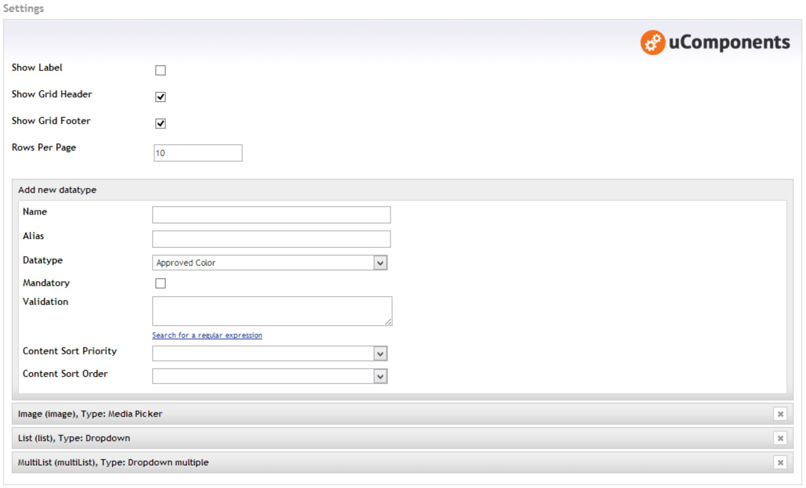
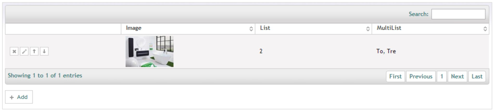
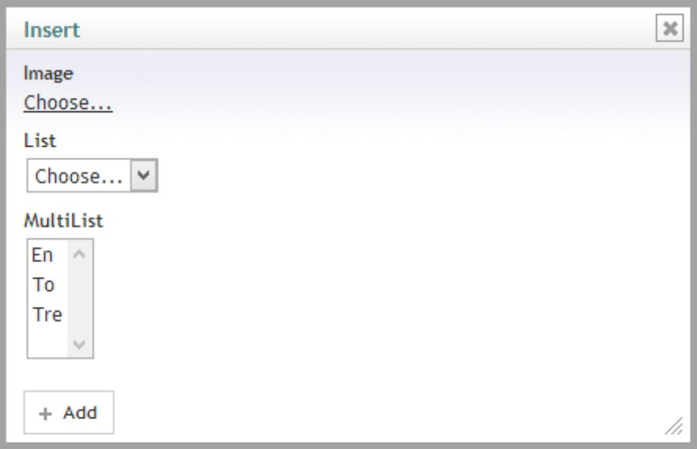

## Table of contents ##
* [Prevalue Editor](#prevalue_editor)
* [Content Editor](#content_editor)
* [Compatible Datatypes](compatible-datatypes)
* [Localization](localization)
* [Razor Samples](razor-samples)
* [Integration](integration)
    
## Prevalue Editor ##

### Content Editor Settings ###
**Show Label:** Toggle the left side label for the content editor.    
**Show Grid Header:** Toggle the visibility for the grid header. Also toggles search functionality.    
**Show Grid Footer:** Toggle the visibility for the grid footer. Also toggles paging.    
**Rows Per Page:** How many rows should be shown per page

### Datatype (Column) Settings ###
**Name:** The column name. Can be localized by inserting the dictionary key prepended with a hash (#).    
**Alias:** The column alias. This is the key for the column.   
**DataType:** The editor datatype for the column. See [using custom datatypes](compatible-datatypes/#using_custom_datatypes) if you want to use custom (untested) datatypes.    
**Mandatory:** Toggles whether a value must be set for this column when inserting or updating a row.   
**Validation:** Custom Regex validation for the column value. Leave blank to disable.    
**Content Sort Priority:** If you want to set a default grid sorting for the content editors, set the column priority here. Leave blank to disable automatic sorting.    
**Content Sort Order:** The grid sorting direction. Only used if Content Sort Priority has been enabled.

## Content Editor ##

### Grid ###

### Add row dialog ###

### Edit row dialog ###
