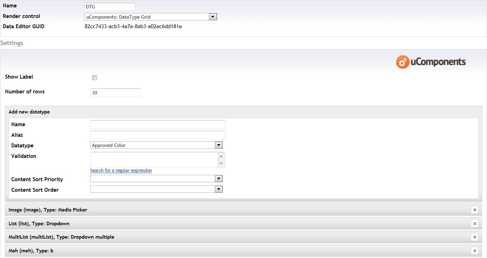
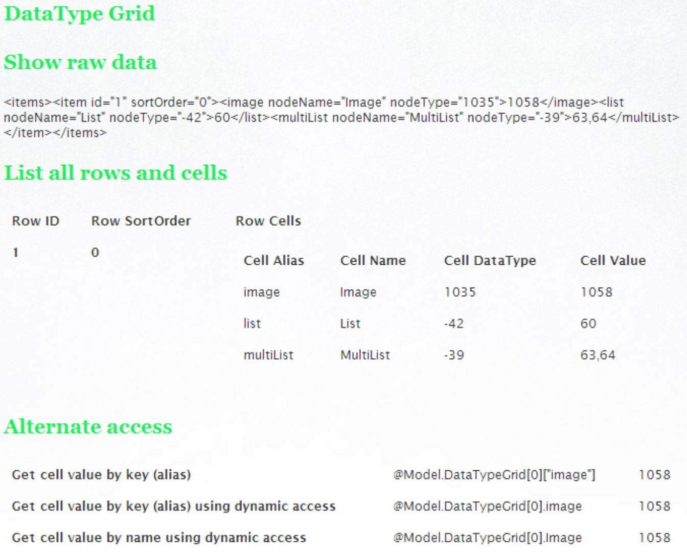

## Table of contents ##
* [Prevalue Editor](#prevalue_editor)
* [Content Editor](#content_editor)
* [Compatible Datatypes](compatible-datatypes.html)
* [Localization](#localization)
* [Razor Samples](#razor_samples)
* [Integration](#integration)
    
## Prevalue Editor ##

### Content Editor Settings ###
**Show Label:** Toggle the left side label for the content editor.    
**Show Grid Header:** Toggle the visibility for the grid header. Also toggles search functionality.    
**Show Grid Footer:** Toggle the visibility for the grid footer. Also toggles paging.    
**Rows Per Page:** How many rows should be shown per page

### Datatype (Column) Settings ###
**Name:** The column name. Can be localized by inserting the dictionary key prepended with a hash (#).    
**Alias:** The column alias. This is the key for the column.   
**DataType:** The editor datatype for the column. See [using custom datatypes](#using_custom_datatypes) if you want to use custom (untested) datatypes.    
**Mandatory:** Toggles whether a value must be set for this column when inserting or updating a row.   
**Validation:** Custom Regex validation for the column value. Leave blank to disable.    
**Content Sort Priority:** If you want to set a default grid sorting for the content editors, set the column priority here. Leave blank to disable automatic sorting.    
**Content Sort Order:** The grid sorting direction. Only used if Content Sort Priority has been enabled.

## Content Editor ##

### Grid ###

### Add row dialog ###

### Edit row dialog ###

## Localization ##
DataType Grid is localizable, meaning you can make your own translation using the Dictionary in the Umbraco backoffice.

Please consult the table of aliases below to create your own translation.

### Content Editor ###
<table border="0">
	<tbody>
		<tr>
			<td>
				<strong>Alias</strong>
			</td>
			<td>
				<strong>Default Value</strong>
			</td>
			<td>
				<strong>Description</strong>
			</td>
		</tr>
		<tr>
			<td>Delete</td>
			<td>Delete</td>
			<td>The button tooltip text for deleting a row</td>
		</tr>
		<tr>
			<td>Edit</td>
			<td>Edit</td>
			<td>The button tooltip text for editing a row</td>
		</tr>
		<tr>
			<td>MoveUp</td>
			<td>Move up</td>
			<td>The button tooltip text for moving a row up</td>
		</tr>
		<tr>
			<td>MoveDown</td>
			<td>Move down</td>
			<td>The button tooltip text for moving a row down</td>
		</tr>
		<tr>
			<td>Add</td>
			<td>Add</td>
			<td>The button text for adding a new row (both in the footer and in the dialog)</td>
		</tr>
		<tr>
			<td>Update</td>
			<td>Update</td>
			<td>The button text for updating a row</td>
		</tr>
	</tbody>
</table>

### Prevalue Editor ###
<table border="0">
	<tbody>
		<tr>
			<td>
				<strong>Alias</strong>
			</td>
			<td>
				<strong>Default Value</strong>
			</td>
			<td>
				<strong>Description</strong>
			</td>
		</tr>
		<tr>
			<td>AddNewDataType</td>
			<td>Add new datatype</td>
			<td>The title text for the "add new datatype" form</td>
		</tr>
		<tr>
			<td>Error</td>
			<td>Error</td>
			<td>The error title for the "add new datatype" form</td>
		</tr>
		<tr>
			<td>Name</td>
			<td>Name</td>
			<td>The name label for the column name</td>
		</tr>
		<tr>
			<td>YouMustSpecifyAName</td>
			<td>You must specify a name</td>
			<td>The error message shown if you didn't specify a name for the column when saving the datatype</td>
		</tr>
		<tr>
			<td>Alias</td>
			<td>Alias</td>
			<td>The alias label for the column alias</td>
		</tr>
		<tr>
			<td>YouMustSpecifyAnAlias</td>
			<td>You must specify an alias</td>
			<td>The error message shown if you didn't specify an alias for the column when saving the datatype</td>
		</tr>
		<tr>
			<td>AliasAlreadyExists</td>
			<td>Alias already exists!</td>
			<td>The error Message shown if the alias you entered already exists</td>
		</tr>
		<tr>
			<td>DataType</td>
			<td>DataType</td>
			<td>The label for the column datatype</td>
		</tr>
		<tr>
			<td>Validation</td>
			<td>Validation</td>
			<td>The label for the column validation string</td>
		</tr>
		<tr>
			<td>SearchForARegularExpression</td>
			<td>Search for a regular expression</td>
			<td>The label for the link that opens a window where you can find regular expressions</td>
		</tr>
		<tr>
			<td>ValidationStringIsNotValid</td>
			<td>Validation string is not valid</td>
			<td>The error Message shown if the validation regex is not valid</td>
		</tr>
		<tr>
			<td>ContentSortPriority</td>
			<td>Content Sort Priority</td>
			<td>The label text for the column sort priority</td>
		</tr>
		<tr>
			<td>ContentSortOrder</td>
			<td>Content Sort Order</td>
			<td>The label text for the column sort order</td>
		</tr>
		<tr>
			<td>Ascending</td>
			<td>Ascending</td>
			<td>The dropdown item text for ascending sort order</td>
		</tr>
		<tr>
			<td>Descending</td>
			<td>Descending</td>
			<td>The dropdown item text for descending sort order</td>
		</tr>
		<tr>
			<td>Type</td>
			<td>Type</td>
			<td>The title text for the "edit datatype" form</td>
		</tr>
		<tr>
			<td>AreYouSureYouWantToDeleteThisColumn</td>
			<td>Are you sure you want to delete this column</td>
			<td>The dialog text shown when trying to delete a column</td>
		</tr>
	</tbody>
</table>

## Razor Samples ##

### Getting DataTypeGrid values ###

#### --> v5.4.0 ####
This example uses a document type that has the following DTG datatype:
    

    
    
It was then populated with the following values:
    

    

    
    
To get out those values using Razor syntax, you can use the following code:
	
	@inherits umbraco.MacroEngines.DynamicNodeContext
	@using uComponents.Core
	@using umbraco.cms.businesslogic.datatype
	
	
Property XML: @Model.DataTypeGrid.ToXml()

	
	<ul>
	    @foreach(var item in Model.DataTypeGrid) {
	        @* Inside here, everything is case-sensitive *@
	        <li>ID: @item.id
	            <table>
	                <tr>
	                    <th>XML</th>
	                    <td>@item.ToXml()</td>
	                </tr>
	                <tr>
	                    <th>Image</th>
	                    <td></td>
	                </tr>
	                <tr>
	                    <th>Dropdown List</th>
	                    <td>
	                        <ul>
	                        @* Display prevalue name instead of id *@
	                        @{ IList<PreValue> preValues1 = uQuery.GetPreValues(int.Parse(item.list.nodeType)); }
	                        @foreach(var i in item.list.InnerText.Split(',')) {
	                            <li>@preValues1.Single(x => x.Id.ToString() == i).Value (#@i)</li>
	                        }
	                        </ul>
	                    </td>
	                </tr>
	                <tr>
	                    <th>Dropdown Multi</th>
	                    <td>
	                        <ul>
	                        @* Display prevalue name instead of id *@
	                        @{ IList<PreValue> preValues2 = uQuery.GetPreValues(int.Parse(item.multiList.nodeType)); }
	                        @foreach(var i in item.multiList.InnerText.Split(',')) {
	                            <li>@preValues2.Single(x => x.Id.ToString() == i).Value (#@i)</li>
	                        }
	                        </ul>
	                    </td>
	                </tr>
	                <tr>
	                    <th>Dropdown List</th>
	                    <td>
	                        <ul>
	                        @* Display prevalue name instead of id *@
	                        @{ IList<PreValue> preValues3 = uQuery.GetPreValues(int.Parse(item.meh.nodeType)); }
	                        @foreach(var i in item.meh.InnerText.Split(',')) {
	                            <li>@preValues3.Single(x => x.Id.ToString() == i).Value (#@i)</li>
	                        }
	                        </ul>
	                    </td>
	                </tr>
	            </table>
	        </li>
	    }
	</ul>
    
This should give you the following output:
    

    
    
#### v5.4.0 -> current ####

This example uses a document type that has the following DTG datatype:

    
    
It was then populated with the following values:
    

    

    
    
To get out those values using Razor syntax, you can use the following code:

	@inherits umbraco.MacroEngines.DynamicNodeContext
		
	<h3>Show raw data</h3>
	
@Model.DataTypeGrid

		
	<h3>List all rows and cells</h3>
	<table cellspacing="0" cellpadding="0">
		<tr>
			<th>Row ID</th>
			<th>Row SortOrder</th>
			<th>Row Cells</th>
		</tr>
		@foreach(var row in Model.DataTypeGrid) {
			<tr>
				<th>@row.Id</th>
				<th>@row.SortOrder</th>
				<td>
					<table cellspacing="0" cellpadding="0">
						<tr>
							<th>Cell Alias</th>
							<th>Cell Name</th>
							<th>Cell DataType</th>
							<th>Cell Value</th>
						</tr>
						@foreach(var cell in row) {
							<tr>
								<td>@cell.Alias</td>
								<td>@cell.Name</td>
								<td>@cell.DataType</td>
								<td>@cell.Value</td>
							</tr>
						}
					</table>
				</td>
			</tr>
		}
	</table>
		
	<h3>Alternate access</h3>
	<table cellspacing="0" cellpadding="0">
		<tr>
			<th>Get cell value by key (alias)</th>
			<td>@Html.Raw("@Model.DataTypeGrid[0][\"image\"]")</td>
			<td>@Model.DataTypeGrid[0]["image"]</td>
		</tr>
		<tr>
			<th>Get cell value by key (alias) using dynamic access</th>
			<td>@Html.Raw("@Model.DataTypeGrid[0].image")</td>
			<td>@Model.DataTypeGrid[0].image</td>
		</tr>
		<tr>
			<th>Get cell value by name using dynamic access</th>
			<td>@Html.Raw("@Model.DataTypeGrid[0].Image")</td>
			<td>@Model.DataTypeGrid[0].Image</td>
		</tr>
	</table>
    	
    
This should give you the following output:

    
## Integration ##
TBD
