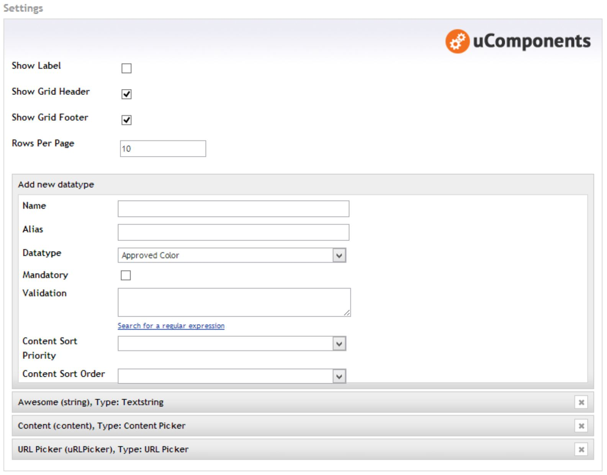
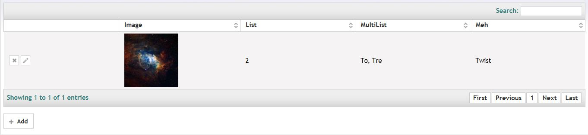
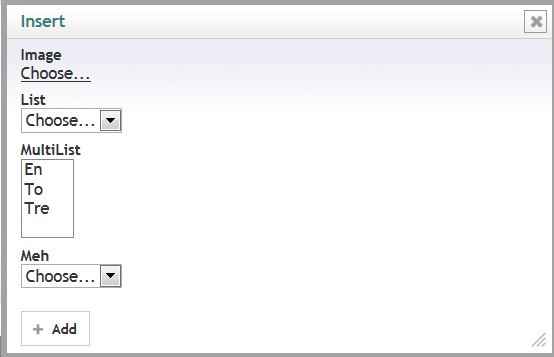
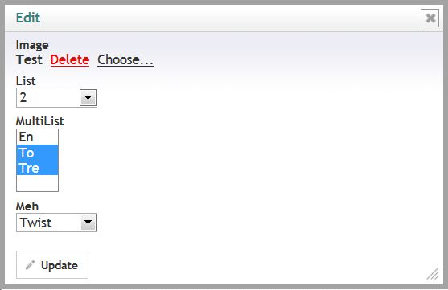
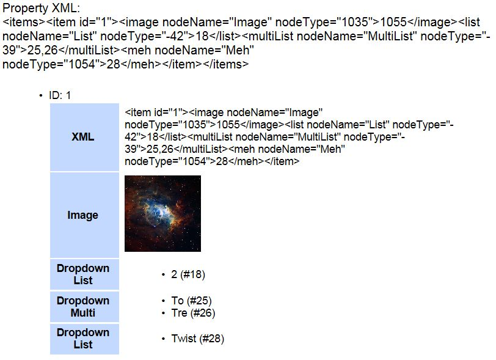

## Table of contents ##
* [Prevalue Editor](#prevalue_editor)
* [Content Editor](#content_editor)
* [Compatible Datatypes](#compatible_datatypes)
* [Localization](#localization)
* [Razor Samples](#razor_samples)

## Prevalue Editor ##

### Content Editor Settings ###
**Show Label:** Toggle the left side label for the content editor.    
**Show Grid Header:** Toggle the visibility for the grid header. Also toggles search functionality.    
**Show Grid Footer:** Toggle the visibility for the grid footer. Also toggles paging.    
**Rows Per Page:** How many rows should be shown per page

### Datatype (Column) Settings ###
**Name:** The column name. Can be localized by inserting the dictionary key prepended with a hash (#).    
**Alias:** The column alias. This is the key for the column.   
**DataType:** The editor datatype for the column. See [using custom datatypes](#using_custom_datatypes) if you want to use custom (untested) datatypes.
**Mandatory:** Toggles whether a value must be set for this column when inserting or updating a row.   
**Validation:** Custom Regex validation for the column value. Leave blank to disable.    
**Content Sort Priority:** If you want to set a default grid sorting for the content editors, set the column priority here. Leave blank to disable automatic sorting.    
**Content Sort Order:** The grid sorting direction. Only used if Content Sort Priority has been enabled.

## Content Editor ##

### Grid ###

### Add row dialog ###

### Edit row dialog ###

## Compatible Datatypes ##

### Using custom datatypes ###
By default, only datatypes that are verified are enabled and selectable from the prevalue editor.
To enable a non-default datatype, go to {your-umbraco-folder}\config and open the file DataTypeGrid.config.

Add your datatype guid to the `<CompatibleDataTypes>` section like this:

    <add guid="6c738306-4c17-4d88-b9bd-6546f3771597"/>
    
Recycle the application pool in IIS or touch the web.config file.
You can now use your datatype with DataType Grid.

## Localization ##
DataType Grid is localizable, meaning you can make your own translation using the Dictionary in the Umbraco backoffice.

Please consult the table of aliases below to create your own translation.

### Content Editor ###

### Prevalue Editor ###

## Razor Samples ##

### Getting DataTypeGrid values ###

#### Pre v5.4.0 ####
This example uses a document type that has the following DTG datatype:

It was then populated with the following values:

To get out those values using Razor syntax, you can use the following code:

	@*
	DataType Grid Sample
	=================================
	This snippet makes lists all values stored in a DataType Grid
	NOTE: The property value is of type DynamicXML.
	      All DynamicXML properties are case-sensitive!
	
	NOTE: It is safe to remove this comment (anything between @ * * @), the code that generates the list is only the below!
	*@
	
	@inherits umbraco.MacroEngines.DynamicNodeContext
	@using uComponents.Core
	@using umbraco.cms.businesslogic.datatype
	
	
Property XML: @Model.DataTypeGrid.ToXml()

	
	<ul>
	    @foreach(var item in Model.DataTypeGrid) {
	        @* Inside here, everything is case-sensitive *@
	        <li>ID: @item.id
	            <table>
	                <tr>
	                    <th>XML</th>
	                    <td>@item.ToXml()</td>
	                </tr>
	                <tr>
	                    <th>Image</th>
	                    <td></td>
	                </tr>
	                <tr>
	                    <th>Dropdown List</th>
	                    <td>
	                        <ul>
	                        @* Display prevalue name instead of id *@
	                        @{ IList<PreValue> preValues1 = uQuery.GetPreValues(int.Parse(item.list.nodeType)); }
	                        @foreach(var i in item.list.InnerText.Split(',')) {
	                            <li>@preValues1.Single(x => x.Id.ToString() == i).Value (#@i)</li>
	                        }
	                        </ul>
	                    </td>
	                </tr>
	                <tr>
	                    <th>Dropdown Multi</th>
	                    <td>
	                        <ul>
	                        @* Display prevalue name instead of id *@
	                        @{ IList<PreValue> preValues2 = uQuery.GetPreValues(int.Parse(item.multiList.nodeType)); }
	                        @foreach(var i in item.multiList.InnerText.Split(',')) {
	                            <li>@preValues2.Single(x => x.Id.ToString() == i).Value (#@i)</li>
	                        }
	                        </ul>
	                    </td>
	                </tr>
	                <tr>
	                    <th>Dropdown List</th>
	                    <td>
	                        <ul>
	                        @* Display prevalue name instead of id *@
	                        @{ IList<PreValue> preValues3 = uQuery.GetPreValues(int.Parse(item.meh.nodeType)); }
	                        @foreach(var i in item.meh.InnerText.Split(',')) {
	                            <li>@preValues3.Single(x => x.Id.ToString() == i).Value (#@i)</li>
	                        }
	                        </ul>
	                    </td>
	                </tr>
	            </table>
	        </li>
	    }
	</ul>

This should give you the following output:

#### v5.4.0 -> current ####
