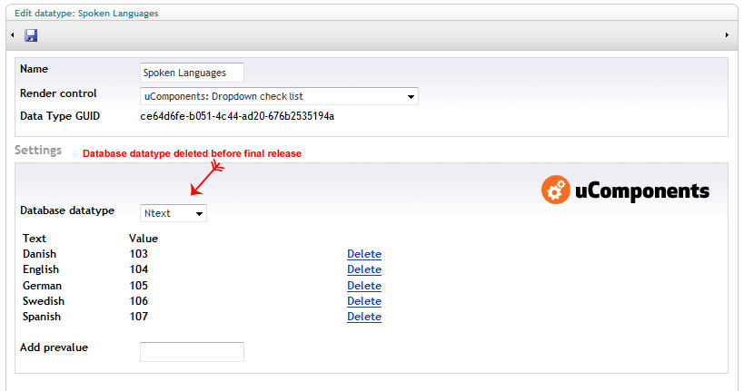
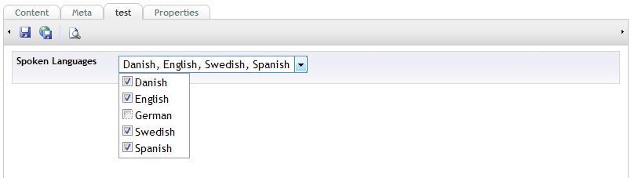

This is a DropDownList containing CheckBoxes.

## Prevalue Editor Settings

Adding items to control

## Content Editor

Using the conrol

## XSLT Example

	<xsl:template match="/">
		<ul>
			<xsl:for-each select="umbraco.library:Split($currentPage/languages[not(@isDoc)], ',')/*">
				<li>
					<xsl:value-of select="."/>
				</li>
			</xsl:for-each>
		</ul>
	</xsl:template>
