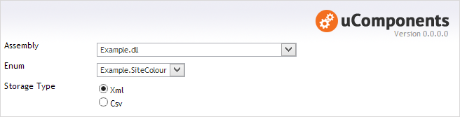
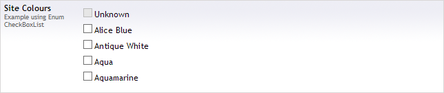

## Prevalue Editor Settings

**Assembly** : the DLL or App_Code folder containing the Enum.

**Enum** : The Enum to use as the data source for the CheckBoxList.

**Storage Type** : Either an Xml fragment, or a CSV.

## Optional Attributes

The enum can be decorated with an optional EnumCheckBoxListAttribute to configure how the Text and Value fields are populated, as well as being able to exclude items from the resulting list.

**Enabled** : a boolean value to indicate if the item should be included in the list.

**Text** : the text to use in the list instead of the Enum item name.

**Value** : the value to use in the list instead of the Enum item name.

    using uComponents.DataTypes.EnumCheckBoxList;

    public enum SiteColours
    {
        [EnumCheckBoxList(Enabled = false)]
        Unknown,

        [EnumCheckBoxList(Text = "Alice Blue", Value = "F0F8FF")]
        AliceBlue,

        [EnumCheckBoxList(Text = "Antique White", Value = "FAEBD7")]
        AntiqueWhite,

        [EnumCheckBoxList(Value = "00FFFF")]
        Aqua,

        [EnumCheckBoxList(Value = "7FFFD4")]
        Aquamarine 
    }

## Content Editor

