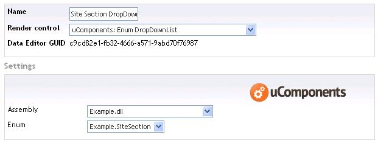
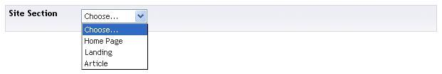

## Prevalue Editor Settings

An optional EnumDropDownListAttribute can be applied to configure how the DropDownList Text and Value fields are populated, as well as being able to exclude enum items from the resulting list.

## Example Enum

	using uComponents.Core.DataTypes.EnumDropDownList; // Namespace to the optional EnumDropDownListAttribute

	namespace Example
	{
		public enum SiteSection
		{
			[EnumDropDownList(Enabled=false)]
			Unknown,

			[EnumDropDownList(Text="Home Page")]
			Home,

			[EnumDropDownList(Value="123")]
			Landing,

			Article
		}
	}

## Pre-value editor settings

## Content editor

## Value stored

The default value stored by the property is the name of the enum item selected, although this can be overridden by setting the Value property on the EnumDropDownListAttribute (as above setting the value of 'Landing').

## uQuery

	SiteSection siteSection = uQuery.GetCurrentNode().GetProperty&lt;SiteSection&gt;("propertyAlias");
