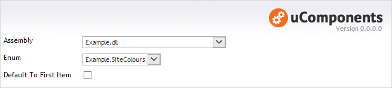
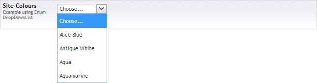

## Prevalue Editor Settings

**Assembly** : The DLL or App_Code folder containing the Enum.

**Enum** : The Enum to use as the data source for the DropDownList.

**Default To First Item** : When checked the first item in the enum will be selected, if this option is unchecked, then the first item in the DropDownList will be "Choose...". If this datatype has been set to be mandatory when placed on a document type, then any selection apart from "Choose..." will be valid.

  
### Optional Enum Attributes

The enum can be decorated with an EnumDropDownListAttribute to configure how the Text and Value fields are are populated, as well as being able to exclude items from the resulting list.

**Enabled** : a boolean value to indicate if the item should be included in the list.

**Text** : the text to use in the list instead of the Enum item name.

**Value** : the value to use in the list instead of the Enum item name.

    using uComponents.DataTypes.EnumDropDownList;

    public enum SiteColour
    {
        [EnumDropDownList(Enabled = false)]
        Unknown,

        [EnumDropDownList(Text = "Alice Blue", Value = "F0F8FF")]
        AliceBlue,

        [EnumDropDownList(Text = "Antique White", Value = "FAEBD7")]
        AntiqueWhite,

        [EnumDropDownList(Value = "00FFFF")]
        Aqua,

        [EnumDropDownList(Value = "7FFFD4")]
        Aquamarine 
    }

  
## Content Editor

From the example enum above:

## Strongly Typed Model

using uQuery the original enum instance can be returned eg.

	SiteColour siteColour = uQuery.GetCurrentNode().GetProperty<SiteColour>("siteColours");
