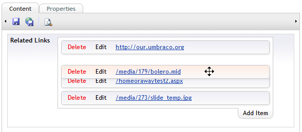

Basically, the user can create and edit multiple instances of a [URL Picker](/data-types/url-picker).  See the [URL Picker documentation page](/data-types/url-picker) for an understanding of the URL Picker's usage.

## User facing ##
### Editing ###

### Drag to sort ###

## Settings ##
Same as [URL Picker](/data-types/url-picker)

## Developer facing ##
Returns either an empty list, or a list of URL Picker items (which may or may not have an empty URL field).  It also supports Razor Model Binding.

The data can be saved in CSV, XML or JSON format, the three looking like this respectively:

    URL,True,,http://our.umbraco.org,
    Content,False,1047,/homeorawaytest2.aspx,
    Media,False,1082,/media/179/bolero.mid,Listen to this!
    Upload,False,,/media/273/slide_temp.jpg,
(for CSV, the headers are the same as with the single URL Picker, and each URL Picker item is one line).

    <multi-url-picker>
        <url-picker mode="URL">
            <new-window>True</new-window>
            <node-id />
            <url>http://our.umbraco.org</url>
            <link-title />
        </url-picker>
        <url-picker mode="Content">
            <new-window>False</new-window>
            <node-id>1047</node-id>
            <url>/homeorawaytest2.aspx</url>
            <link-title />
        </url-picker>
        <url-picker mode="Media">
            <new-window>False</new-window>
            <node-id>1082</node-id>
            <url>/media/179/bolero.mid</url>
            <link-title>Listen to this!</link-title>
        </url-picker>
        <url-picker mode="Upload">
            <new-window>False</new-window>
            <node-id />
            <url>/media/273/slide_temp.jpg</url>
            <link-title />
        </url-picker>
    </multi-url-picker>

    {
        "Items":[
            {
                "Title":null,
                "Mode":1,
                "NodeId":null,
                "Url":"http://our.umbraco.org",
                "NewWindow":false
            },
            {
                "Title":null,
                "Mode":2,
                "NodeId":1047,
                "Url":"/homeorawaytest2.aspx",
                "NewWindow":false
            },
            {
                "Title":"Listen to this!",
                "Mode":3,
                "NodeId":1082,
                "Url":"/media/179/bolero.mid",
                "NewWindow":false
            },
            {
                "Title":null,
                "Mode":4,
                "NodeId":null,
                "Url":"/media/273/slide_temp.jpg",
                "NewWindow":false
            }
        ]
    }

If the Multi-URL Picker is to be used in a .NET control, you can deserialize any of the above data strings to a strongly typed object - using the static method `uComponents.Core.DataTypes.MultiUrlPicker.Dto.MultiUrlPickerState.Deserialize`.