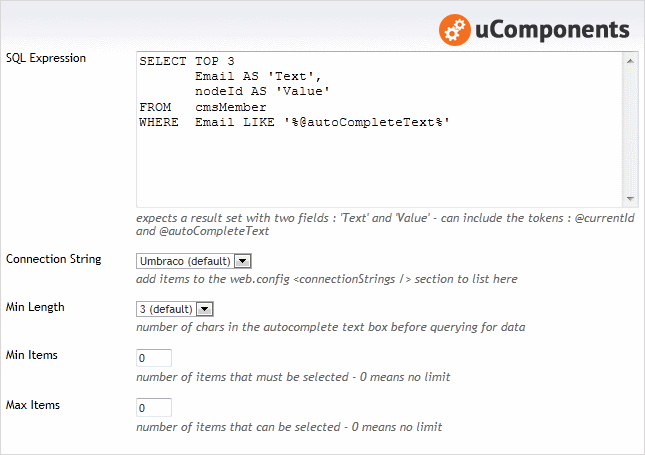

## Prevalue Editor Settings

The **SQL Expression** must return two columns: a _'Text'_ field that's used for the visible text and a _'Value'_ field that's used to identify an item. Two parameters (or tokens) can be used within this expression, a _@currentId_ token will be substituted with the current Document / Media or Member Id being edited, whilst the _@autoCompleteText_ token will be substituted with the text currently in the textbox, allowing a more specific query to be made.

The **Connection string** is configured via a drop down selection, which defaults to the current Umbraco database. If there are connection strings defined in the web.config, these become selectable options. (The connection string name is stored, so migration between environments can all be controlled via the web.config).

	<configuration>
		<connectionStrings>
			<add name="" connectionString="server=;database=;user id=;password=" />
		</connectionStrings>
	</configuration>

The **Min Length** setting dictates how many characters are required in the textbox before any requests for data are made. (This value coupled with a TOP x statement in the sql expression, can allow the fine tuning of the number of requests made and the amount of data transferred).

**Min Items** specifies the number of items that must be selected, a value of 0 indicates that there is no minimum requirement.

**Max Items** specifies the number of items that can be selected, if this value is 0 then no maximum limit is imposed.

## Content Editor

## Example XML
	<SqlAutoComplete>
		<Item Text="member1@anywhere.com" Value="1062" />
		<Item Text="member2@anywhere.com" Value="1063" />
		<Item Text="member1002@anywhere.com" Value="2063" />
	</SqlAutoComplete>

