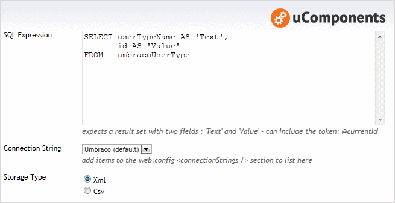
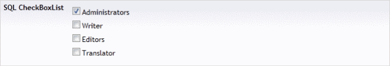

## Prevalue Editor Settings

The **SQL Expression** must return two columns: a _'Text'_ field that's used for the visible text and a _'Value'_ field that's used to identify an item. The parameter (or token) _@currentId_ can be used in the SQL, and will be substituted with the id of the Document / Media or Member that the datatype is a property on.

The **Connection string** is configured via a drop down selection, which defaults to the current Umbraco database. If there are connection strings defined in the web.config, these become selectable options. (The connection string name is stored, so migration between environments can all be controlled via the web.config).

	<configuration>
		<connectionStrings>
			<add name="" connectionString="server=;database=;user id=;password=" />
		</connectionStrings>
	</configuration>

The **Storage Type** can be either a CSV or XML fragment of the selected values.

## Content Editor

## Example XML

	<SqlCheckBoxList>
		<value>100</value>
		<value>101</value>
	</SqlCheckBoxList>

## Example SQL

### All Member Groups

	SELECT	id AS 'Value',
		text AS 'Text'
	FROM	umbracoNode
	WHERE	nodeObjectType = '366e63b9-880f-4e13-a61c-98069b029728'

