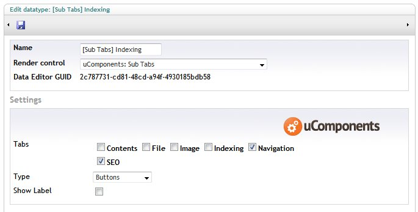
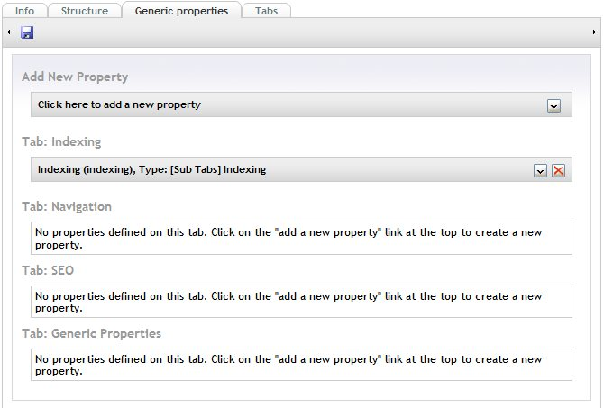
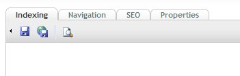
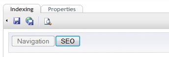

## Prevalue Editor Settings

**Tabs** : the tabs to hide

**Type** : either a drop down list, or series of buttons

**Show Label** : allows hiding the name and description

## Setting

Note: this datatype expects to be be only property on a tab - this is because it works by firing the Umbraco click event on the hidden tab, and moving itself to be the first property on that tab - on load it defaults to the first hidden tab, so any original sibling properties would never be displayed.

## Content Editor

Before:

After:

