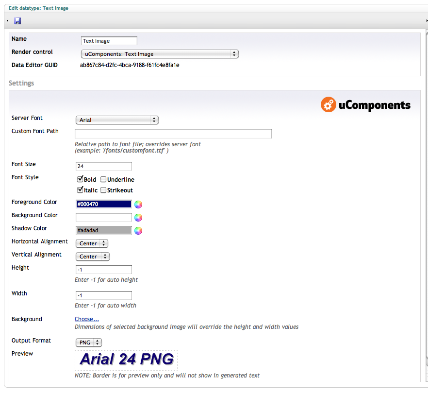
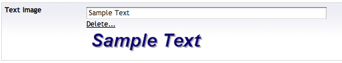

The TextImage datatype allows for generation of an image of text based on settings (color, background, font, size, position, etc..)

It allows the use of server fonts as well as a custom font (TTF file)

It appears on doctypes as a standard textbox, but generates an image file on save (displayed in a preview)

## Prevalue Editor Settings

## Content Editor

## XSLT Example

	
