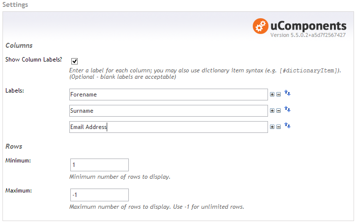
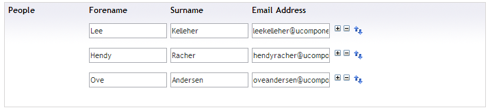

## Video Demo
<iframe src="http://www.screenr.com/embed/23Xs" width="650" height="396" frameborder="0">&nbsp;</iframe>

## Prevalue Editor Settings

The data-type has the following configuration options:

* Columns
  * **Show Column Labels?**
  * **Labels:** Enter a label for each column; you may also use dictionary item syntax (e.g. `[#dictionaryItem]`). _(Optional - blank labels are acceptable)_
* Rows
  * **Minimum:** Minimum number of rows to display.
  * **Maximum:** Maximum number of rows to display. Use `-1` for unlimited rows.

## Content Editor

## Example XML
	<TextstringArray>
		<values>
			<value>hello</value>
			<value>world</value>
		</values>
		<values>
			<value>foo bar</value>
			<value>world</value>
		</values>
	</TextstringArray>

## Example Razor (DynamicNode)
With the Razor model-binding enabled, the property will automatically be converted to the appropriate .NET object type. 
In the case of TextstringArray, the object type is a `List<string[]>` (e.g. a list of string arrays):

	@inherits umbraco.MacroEngines.DynamicNodeContext
	<table>
		@foreach (string[] row in Model.textstringArrayPropertyAlias)
		{
			<tr>
				@foreach (var cell in row)
				{
					<td>@cell</td>
				}
			</tr>
		}
	</table>

## Example XSLT

	<xsl:for-each select="*/TextstringArray/values">
		<strong><xsl:value-of select="value[1]" /></strong>
		<xsl:value-of select="value[2]" />
	</xsl:for-each>

<!-- Advanced XSLT by @greystate : https://gist.github.com/greystate/7240897 -->