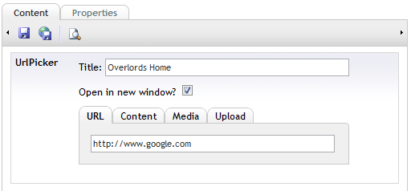
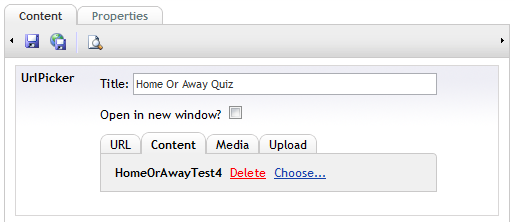
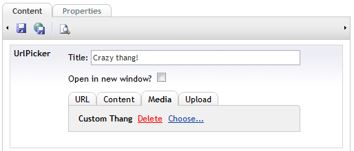
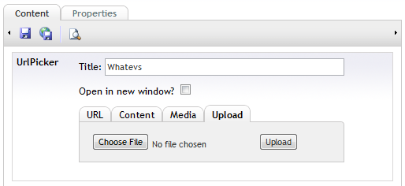
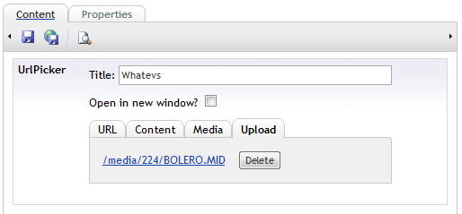
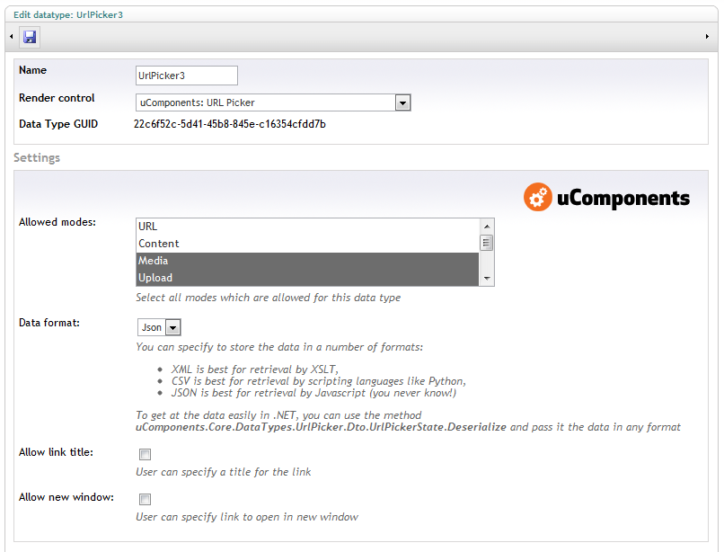
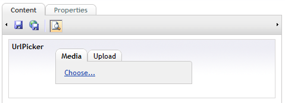

If you've ever been in the situation where someone demands:
_"I want that link to point to either another website or a page in this website or a media item or a file I can upload"_
then this datatype is the answer to that very annoying demand.

## User facing ##
It allows the user to select where they want the URL to come from, either a

### Hand typed URL ###

### Content node ###

### Media node ###

### File upload ###

## Settings ##
The four modes are "URL, Content, Media, Upload".  These modes can be allowed or disallowed in the prevalue editor:

Through the settings, the user can be given a very small subset of options:

## Developer facing ##
A URL is always returned when possible, if a node is selected then that node ID is returned also, and the user can specify a title and whether the link opens in a new window.  It also supports Razor Model Binding.

The data can be saved in CSV, XML or JSON format (the future!), the three looking like this respectively:
    Content,False,1061,/homeorawaytest4.aspx,Home Or Away Quiz
(where the headers are "Url Picker Mode, New Window, Node ID, URL, Link Title")

    <url-picker mode="Content">
            <new-window>False</new-window>
            <node-id>1061</node-id>
            <url>/homeorawaytest4.aspx</url>
            <link-title>Home Or Away Quiz</link-title>
    </url-picker>

    {
       "Title" : "Home Or Away Quiz",
       "Mode" : 2,
       "NodeId" : 1061,
       "Url" : "/homeorawaytest4.aspx",
       "NewWindow" : false
    }

Additionally, if the URL Picker is to be used in a .NET control, you can deserialize any of the above data strings to a strongly typed object - using the static method `uComponents.DataTypes.UrlPicker.Dto.UrlPickerState.Deserialize` (literal values for the mode are specificed at `uComponents.DataTypes.UrlPicker.UrlPickerMode`).  Nice!

##Razor/C# samples

If you are using Umbraco v6+ and uComponents v6+ then you can use the included property editor property converter.

e.g. using the strongly typed Model:

	@using uComponents.DataTypes.UrlPicker
	@using uComponents.DataTypes.UrlPicker.Dto;
	
	@{
		if (Model.Content.HasValue("urlPicker"))
		{
			var urlPicker = Model.Content.GetPropertyValue<UrlPickerState>("urlPicker");
			if (urlPicker != null)
			{
				var urlPickerLinkTarget = (urlPicker.NewWindow) ? " target=\"_blank\"" : String.Empty;                            
				var urlPickerLinkUrl = urlPicker.Mode == UrlPickerMode.Content && urlPicker.NodeId != null ? Umbraco.NiceUrl((int)urlPicker.NodeId) : urlPicker.Url;
				<a href="@urlPickerLinkUrl" @Html.Raw(urlPickerLinkTarget)>@urlPicker.Title</a> 
			}
		}
	}
