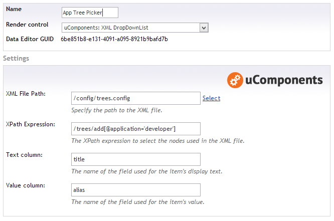
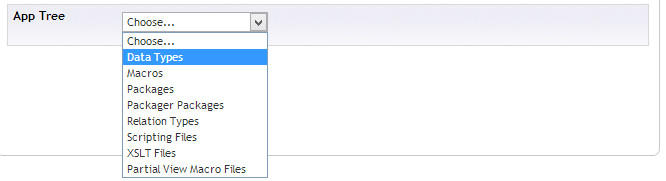

Use an XML file as the source for a DropDownList.

An XPath expression can be specified to select which nodes are used for the DropDownList's Text and Value fields.

## Pre-value editor settings

## Content editor

## Value stored

The default value stored by the property is the value of the XML node selected.
