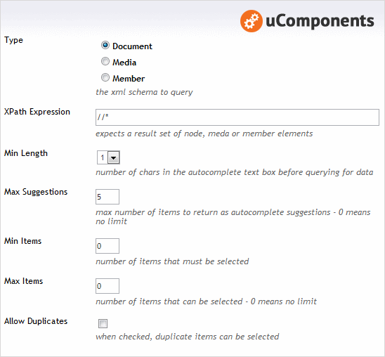
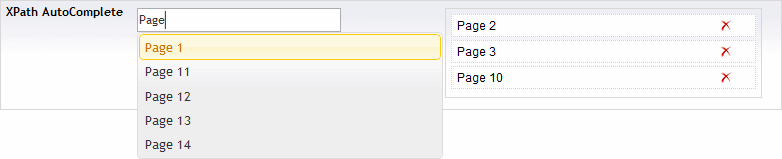

## Prevalue Editor Settings

## Content Editor

## Example XML

	<XPathAutoComplete Type="c66ba18e-eaf3-4cff-8a22-41b16d66a972">
		<Item Text="Page 2" Value="1080" />
		<Item Text="Page 3" Value="1081" />
		<Item Text="Page 10" Value="1091" />
	</XPathAutoComplete>