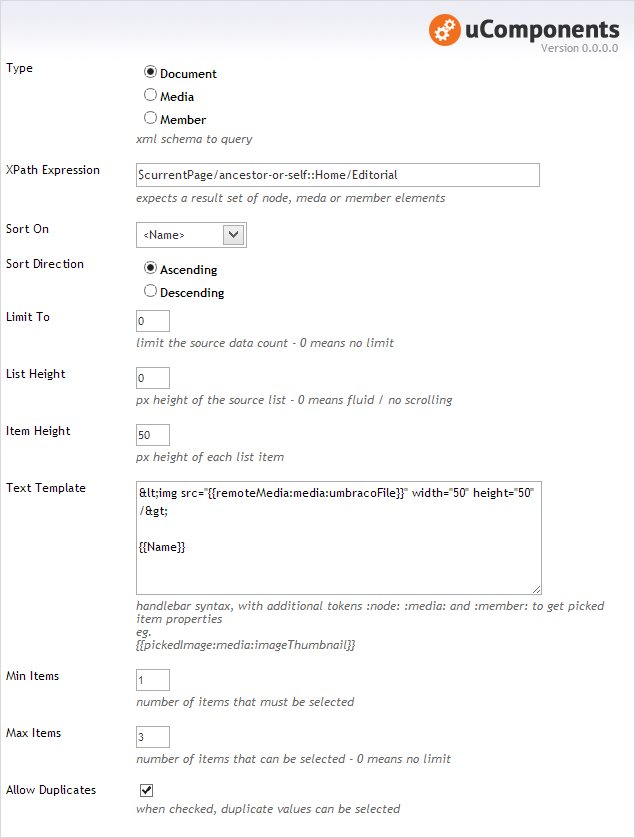

Use an XPath expression to specify a collection of nodes / media or members can be selected, this collection can be sorted and limited and the markup for each item defined by simple text template (TODO: or a Razor / XSLT Macro).

Validation can be defined to specify a minimum and / or maximum selection and if duplicate items can be selected.

## Prevalue Editor Settings

