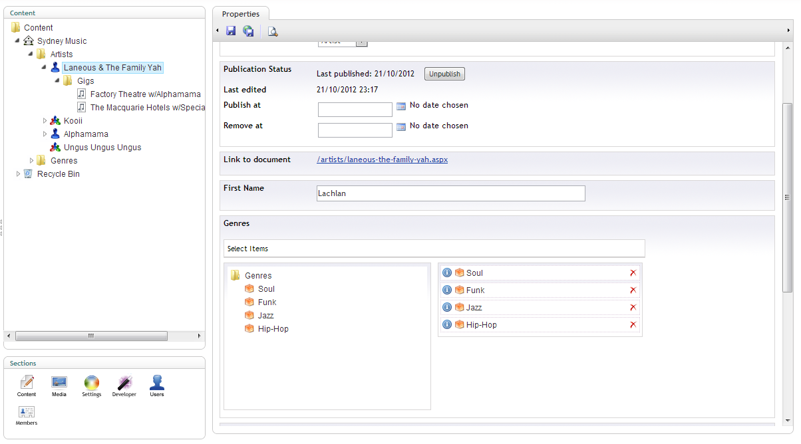

  <h1>uMapper</h1>

_Available in uComponents 5.1.0_

uMapper lets .NET developers map nodes to strongly typed objects with minimal configuration.  It does its best to map the properties of a node to an object by name, but features a fluent interface for manual configuration in the much the same way AutoMapper does.

I've put together an [example project](https://bitbucket.org/JamesDiacono/umapperexample/src) with Umbraco 4.9.0 which shows example usage of uMapper. The username and password to the Umbraco back office are both "admin".

## Usage (minimal configuration) ##
1. Add a reference to uComponents.Mapping.dll in your web project (this should already be added if you used NuGet to install uComponents).
2. Create your document types in Umbraco:

Make sure you use CSV as the data format for any multi-node pickers you use.
3. Create your corresponding models as .NET classes in your project, naming the classes the same as the document type aliases:

public class Artist
{
    public string Name { get; set; }
    public List<Genre> Genres { get; set; }
}
 
4. Create a `Global.asax` file and on `Application_Start()` create your maps:

protected void Application_Start(object sender, EventArgs e)
{
    uMapper.CreateMap<Site>();
    uMapper.CreateMap<Genre>();
    uMapper.CreateMap<Artist>();
}
 
5. Get some nice data!

public partial class Site : System.Web.UI.MasterPage
{
    protected Homepage Model { get; set; }
    protected IEnumerable<Artist> Artists { get; set; }
    protected IEnumerable<Genre> Genres { get; set; }

    protected void Page_Load(object sender, EventArgs e)
    {
        this.Model = uMapper.Query<Homepage>().Current();

        this.Artists = uMapper.Query<Artist>()
            .All()
            .OrderBy(artist => artist.Name);
            
        this.Genres = uMapper.Query<Genre>().All();
		
		var featuredGenre = uMapper.Query<Genre>().Single(1234); // node ID is 1234
    }
}
 
## Default mapping behaviour for model property types ##
* System types and enums are mapped via `Node.GetProperty<TDestination>()` (including nullables)
* A collection of `TDestination` (without a corresponding node property) will map from all descendant nodes which map to `TDestination`.
* A `TDestination` (without a corresponding node property) will map the closest ancestor node which maps to `TDestination`.
* Using a collection of `int` will map node IDs rather than models.
* Properties with the same name as properties on `umbraco.NodeFactory.Node` will map automagically.
* Custom collections which implement `IEnumerable<>` and take a single argument constructor of `IEnumerable<>` can be used.

## Advanced ##
### Overriding the node type alias ###
`uMapper.CreateMap<Artist>("SomeNodeTypeAlias");`
### Overriding the default property mapping ###

uMapper.CreateMap<Artist>()
    .ForProperty(
        x => x.Name, // Choose the model property
        (node, paths) => node.GetProperty<string>("AlternateName"), // Specify a custom mapping
        false // Decide if this mapping counts as a relationship
        );
 
### Removing the default mapping for a property ###
`uMapper.CreateMap<Artist>().RemoveMappingForProperty(x => x.Name);`
### Mapping without populating relationships ###

// By default relationships are not mapped
var artist = uMapper.Query<Artist>().Single(1063); // artist.Genres == null
 
### Querying ###
Calling the `uMapper.Query<TDestination>()` methods gets you a fluent interface to 'query' nodes.
I say 'query' because it doesn't implement `IQueryable` (probably never will).
If you hunger for more query methods, you can write your own extension methods for `INodeQuery<TDestination>`.

// Maps the current node
var a = uMapper.Query<Artist>().Current();
    
// Maps a node by ID (returns null if it doesn't exist)
var b = uMapper.Query<Artist>().Single(1234);
    
// Maps many nodes
var c = uMapper.Query<Artist>().Many(new[] { 1111, 2222, 3333 });
    
// Maps all nodes which can be mapped to 'Artist'
var d = uMapper.Query<Artist>().All();
    
// Maps all nodes which were explicitly mapped to 'Artist'
var e = uMapper.Query<Artist>().AllExplicit();

#### Mapping relationships with paths ####

var homepage = uMapper.Query<Homepage>()
    .Include(x => x.Genres) // Single level path
    .Include(x => x.Artists.Select(y => y.Genres)) // Syntax for multi-level paths
    .Current(); // Maps the current node

    homepage.Genres // populated
    homepage.FeaturedArtist // null, as it was not included
    homepage.Artists // populated
    homepage.Artists.First().Genres // populated
    
// You can also use string paths (as deep as you like):
var otherHomepage = uMapper.Query<Homepage>()
    .Include("Artists.Genres")
    .Current();
  
### Inheritance ###

// You can structure your model classes to reflect the inheritance
// in the document type tree.

// Create your base map first.
uMapper.CreateMap<Artist>() // maps from "Artist" node type
	.ForProperty(x => x.Name, (node, paths) => "Hello", false);

// Create your derived maps later.
//
// The model SoloArtist inherits from Artist.
//
// This creates a map from the "SoloArtist" node type, 
// which inherits from the "Artist" node type.
uMapper.CreateMap<SoloArtist>(); 

var soloArtist = uMapper.GetSingle<SoloArtist>(1061);
// soloArtist.Name == "Hello"

// You can map a node to a base model.
var artist = uMapper.Query<Artist>().Single(1061); 

// And cast it back: 
(artist as SoloArtist).Name // "Hello"

// Or get every node which maps to a base model:
List<Artist> allArtists = uMapper.Query<Artist>().All(); // contains Artist and SoloArtist items

// Or get every node which is explicitly mapped to the base model:
List<Artist> baseArtists = uMapper.Query<Artist>().AllExplicit(); // contains only Artist
 